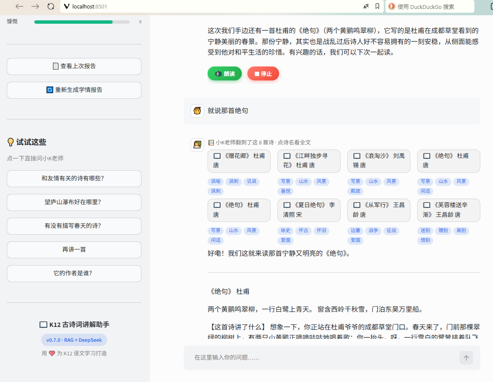
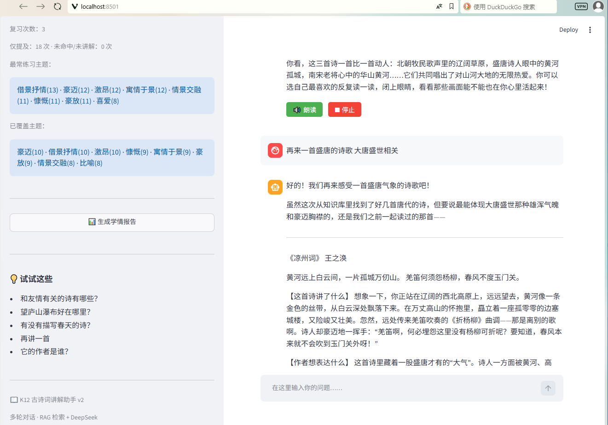

# 📖 K12 古诗词 RAG 讲解助手

> 一个**本地优先**的 K12 语文学习助手：像聊天一样提问，系统先用 RAG 从 80 首古诗词知识库检索相关诗歌，再让 DeepSeek 生成适合学生理解的分板块讲解，并持续沉淀学情、生成给家长看的学习报告。

<p>


</p>

---

## 一句话简介

在本机或同一局域网就能跑起来的 **K12 古诗词 RAG 学习助手**。学生自然语言提问 → 系统检索本地知识库找到相关诗 → 结合最近对话历史，让「小K老师」分板块讲解；回答**逐字流式呈现**，上方**亮出检索到的来源诗**；侧边栏用**可视化图表**记录学情，并能一键生成家长版学情报告。

## ✨ 功能亮点

| 能力 | 说明 |
|---|---|
| 🏠 **本地优先** | 知识库、Chroma 向量库、SQLite 学习记录全部落在本机，适合个人演示与同一局域网试用。 |
| 🔁 **完整 RAG 闭环** | 覆盖古诗整理 → 向量建库 → 标签生成 → 混合检索 → 对话讲解 → 学情记录 → 报告生成。 |
| 🔎 **混合检索** | 语义向量 + 中文 n-gram 关键词/标签匹配，缓解「换个问法就搜不到」。 |
| ⌨️ **流式讲解** | 回答打字机式逐字出现，等待感更低；结尾的隐藏学习标记实时隐藏、不外泄。 |
| 🃏 **来源可见** | 每次回答上方以卡片展示检索命中的诗与主题标签，RAG 的「有据可依」看得见。 |
| 📊 **学情可视化** | 侧边栏用水平条形 meter + 进度条呈现练习主题、覆盖面与已学进度，家长一眼看懂。 |
| 👥 **多用户隔离** | 以持久化 `learner_id` 区分不同浏览器/设备的学情，同一局域网多个学生不再共用一份统计。 |
| 🧒 **学生友好** | Prompt 约束为耐心、清楚、分板块的讲解方式，优先转述知识库赏析，避免成人化堆砌。 |
| 💬 **多轮对话** | 支持「再讲一首」「它的作者是谁」这类接续追问，可恢复最近 5 轮对话。 |
| 🔊 **朗读** | 浏览器内置 TTS 朗读讲解，免 Key、免插件。 |
| 🔒 **访问保护** | 局域网访问需口令，浏览器可选记住 7 天，避免裸奔。 |

## 🖼️ 效果预览

### 聊天讲解 · 流式输出 + 来源卡片

学生输入自然语言问题后，回答上方先亮出检索到的候选诗（诗名 + 标签），正文再逐字流式给出【原文】【讲了什么】【想表达什么】【写得好的地方】等分板块讲解。



### 学习概览 · 可视化学情

侧边栏持续展示学习统计、已学进度条、练习主题与覆盖主题的条形图；学情报告在弹窗中查看，可随时重新生成。



> 截图为早期版本示意，最新版已加入流式输出、来源卡片与条形图学情。

## 🎯 项目背景

目标是验证一套可迁移到教育辅导场景的 RAG 能力。古诗词天然「一首一块」，且讲解高度依赖背景、注释与赏析，非常适合作为 RAG 技术路线的试验田。

用户提问后，系统先检索本地 Chroma 知识库，再把检索结果、最近对话历史与讲解规则一起发给 DeepSeek。**模型只基于检索到的内容回答**；知识库里确实没有合适的诗时，会明确说明找不到，而不是靠训练记忆硬编。

**主要入口**

| 文件 | 作用 |
|---|---|
| `app.py` | Streamlit 网页聊天入口（流式讲解、来源卡片、学情可视化） |
| `build_rag_db.py` | 读取古诗文本并构建本地 Chroma 向量库 |
| `tag_poems.py` | 调用 DeepSeek 为每首诗生成主题标签 |
| `update_chroma_tags.py` | 把标签写入 Chroma metadata，供混合检索使用 |
| `rag_chat.py` | 命令行 RAG 对话脚本 |
| `search_rag.py` | 命令行检索测试脚本 |
| `k12_helper.py` | 命令行错题讲解与 OCR 识别脚本 |
| `learning_db.py` | 本地 SQLite 学习记录、聊天历史与统计 |

## 🧰 技术栈

| 模块 | 使用技术 | 作用 |
|---|---|---|
| Web 界面 | Python + Streamlit | 本地/局域网聊天界面 |
| 大模型 | DeepSeek API（OpenAI SDK 兼容） | 生成讲解与学情报告 |
| 模型名称 | `deepseek-v4-pro` | 当前代码使用的 DeepSeek 模型 |
| 向量数据库 | ChromaDB `PersistentClient` | 本地落盘保存古诗向量 |
| Embedding | `BAAI/bge-small-zh-v1.5` | 中文语义向量化，本地运行 |
| 检索策略 | 语义检索 + 关键词/标签匹配 | 提升主题、手法、意象类问题召回 |
| 学习记录 | SQLite | 保存本地学习行为、聊天历史与统计 |
| OCR | Tesseract + Pillow | 命令行图片题识别 |

> **安全边界**：本项目只使用本地 Chroma `PersistentClient`，直接读写 `chroma_db/`，不以 Chroma HTTP server 方式运行，也不开放网络端口。

## 🚀 快速开始

以下以 Windows PowerShell 为例，首次运行建议使用虚拟环境。

### 1. 获取代码

```powershell
git clone https://github.com/dosheda/k12.git
cd k12
```

### 2. 安装依赖

```powershell
python -m venv .venv
.\.venv\Scripts\Activate.ps1
python -m pip install --upgrade pip
pip install -r requirements.txt
```

> 首次加载 `BAAI/bge-small-zh-v1.5` 会下载约 100MB 模型文件，之后使用本地缓存。

### 3. 配置环境变量

需要两个关键变量：

- `DEEPSEEK_API_KEY`：DeepSeek API key，用于调用大模型。
- `K12_HELPER_ACCESS_CODE`：网页访问口令，用于本地/局域网访问保护。

仅当前 PowerShell 窗口临时生效：

```powershell
$env:DEEPSEEK_API_KEY = Read-Host "请输入 DeepSeek API Key"
$env:K12_HELPER_ACCESS_CODE = Read-Host "请输入网页访问口令"
```

写入当前 Windows 用户环境变量（新开窗口也可读取）：

```powershell
[Environment]::SetEnvironmentVariable("DEEPSEEK_API_KEY", (Read-Host "请输入 DeepSeek API Key"), "User")
[Environment]::SetEnvironmentVariable("K12_HELPER_ACCESS_CODE", (Read-Host "请输入网页访问口令"), "User")
```

> ⚠️ 不要把 API key 或访问口令写进代码、`.env`、`.bat`、截图或任何会提交的文件。

### 4. 准备数据（默认已在项目根目录）

- `古诗词1-80_整理版.txt`：建库用的 80 首古诗整理文本。
- `诗名-标签对照表.txt`：主题标签对照表。

数据放在别处时可用环境变量覆盖：`K12_HELPER_DATA_DIR`，或分别设置 `K12_POEM_1_80_PATH`、`K12_POEM_TAGS_PATH`、`K12_CHROMA_DB_PATH`、`K12_LEARNING_DB_PATH`。

### 5. 构建向量库

```powershell
python build_rag_db.py
```

按 `=====` 切分成一首一块，用中文 embedding 向量化后写入本地 `chroma_db/`。若已有旧库，会先备份为带时间戳的目录再重建。

### 6. 生成并写入标签

```powershell
python tag_poems.py          # 调 DeepSeek 生成标签（消耗 API）
python update_chroma_tags.py # 把标签写入 Chroma metadata
```

> 若已有可用的 `诗名-标签对照表.txt`，可跳过 `tag_poems.py`，只运行 `update_chroma_tags.py`。

### 7. 启动网页应用

```powershell
# 本机访问
python -m streamlit run app.py

# 同一局域网访问
python -m streamlit run app.py --server.address 0.0.0.0 --server.port 8501
```

浏览器打开 `http://localhost:8501`（或 `http://你的局域网IP:8501`）。首次进入需输入访问口令，勾选「在此设备记住 7 天」后刷新免输入；侧边栏「退出登录」可清除记住状态。局域网访问不通时，检查 Windows 防火墙是否放行 Python / 8501 端口。

## 📚 使用说明

直接在聊天框提问，例如：

- 和友情有关的诗有哪些？
- 望庐山瀑布好在哪里？
- 有没有描写春天的诗？
- 再讲一首同类型的。
- 它的作者是谁？

**关于学情统计**：只有模型真正展开讲解或复习过的诗才计入「已学习」；候选诗和仅顺嘴提到的诗不会算作已学习。统计按 `learner_id` 归属，不同浏览器/设备各自独立；点击「开始新对话」只新建聊天会话，**不会清空学情统计**。

**关于对话恢复**：聊天正文按浏览器会话保存到本地 SQLite，刷新或重开浏览器会自动恢复最近 5 轮对话。

**关于学情报告**：点击「生成学情报告」后在弹窗中查看；关闭后侧边栏保留「查看上次报告」入口，需要用最新数据时再点「重新生成」。

## 🖥️ 命令行工具

```powershell
python search_rag.py   # 检索测试
python rag_chat.py     # 命令行 RAG 对话
python k12_helper.py   # 错题讲解与 OCR（需本机安装 Tesseract）
```

> OCR 默认 Tesseract 路径为 `C:\Program Files\Tesseract-OCR\tesseract.exe`，可用 `TESSERACT_CMD` 覆盖。

## 🔀 系统流程

**建库流程**

```text
古诗整理文本
  → 按 ===== 切分
  → BAAI/bge-small-zh-v1.5 向量化
  → 写入本地 Chroma collection: poems
  → 生成主题标签 → 写入 Chroma metadata
```

**问答流程**

```text
学生提问
  → 输入长度与频率校验
  → 语义向量检索 + 关键词/标签匹配 → 合并排序候选诗
  → 亮出来源卡片
  → 拼接 RAG 上下文 + 最近对话历史 + 讲解规则
  → 流式调用 DeepSeek，逐字渲染
  → 解析隐藏学习标记 → 按学习者写入本地 SQLite
```

> 核心原则：**检索负责「找资料」，模型负责「基于资料讲解」**。检索结果不支持回答时，模型应诚实说明知识库暂时没有合适内容。

## 🧩 工程亮点（踩坑与取舍）

- **纯向量检索漏召回** → 混合检索：保留语义向量，叠加零依赖中文 n-gram 关键词匹配，并为每首诗补充题材/情感/手法/意象标签、对标签命中加权，让「托物言志」「借物喻人」都能召回《石灰吟》《竹石》《墨梅》。
- **检索失手不硬凑** → Prompt 明确要求：检索到的诗都不符合时，如实说「知识库里目前的诗都不太符合这个问题」，不靠训练记忆编造。
- **赏析对齐知识库** → 规则要求模型在赏析环节优先转述知识库已有赏析，资料未覆盖时才补充自己的理解。
- **学情不误统计** → 模型在回答末尾输出隐藏 JSON 学习标记，区分真正讲解 / 复习 / 仅提及 / 未命中，避免把候选诗误计入已学习；流式渲染时该标记实时隐藏、不外泄。
- **检索对齐不靠猜** → 诗文、标题、标签统一取自 Chroma 同一条记录，不再用外部文本下标去配 `collection.get()`（其返回顺序不保证），从根上消除错位。

## 🔐 数据与安全

- API key 只从环境变量 `DEEPSEEK_API_KEY` 读取；访问口令只从 `K12_HELPER_ACCESS_CODE` 读取。
- `chroma_db/`、`learning_records.db`、`.env`、本地启动脚本与凭证文件不应提交到 Git。
- Chroma 只允许本地 `PersistentClient`，不运行 HTTP server。
- 学习记录与聊天正文保存在本地 SQLite；接入真实学生/家长数据前需补充隐私提示、数据保留与清空策略。
- 普通提问与学情报告会把问题/必要摘要发送给 DeepSeek；代码已对输入长度与调用频率做基础限制。

## 🗂️ 项目结构

```text
.
├─ app.py                    # Streamlit 网页入口（流式讲解 / 来源卡片 / 学情可视化）
├─ config.py                 # 路径、环境变量与限制配置
├─ build_rag_db.py           # 构建 Chroma 向量库
├─ tag_poems.py              # 调 DeepSeek 生成诗歌标签
├─ update_chroma_tags.py     # 标签写入 Chroma metadata
├─ rag_chat.py               # 命令行 RAG 对话
├─ search_rag.py             # 命令行检索测试
├─ k12_helper.py             # 命令行错题 / OCR 助手
├─ learning_db.py            # SQLite 学习记录、聊天历史与统计
├─ learning_record_utils.py  # 学习标记解析与记录构建
├─ auth_utils.py             # 访问口令「记住设备」签名 token
├─ api_utils.py              # API 响应校验与错误分类
├─ safe_io.py                # 备份与原子写入工具
├─ docs/screenshots/         # README 效果截图
├─ 古诗词1-80_整理版.txt      # 古诗词知识库文本
├─ 诗名-标签对照表.txt        # 诗歌主题标签
└─ requirements.txt          # Python 依赖
```

运行后会在本地生成 `chroma_db/`（向量库）、`learning_records.db`（学习记录 + 聊天历史）与 `*.bak_*`（自动备份），默认不提交到 Git。

## 🕒 版本历程

| 版本 | 日期 | 亮点 |
|---|---|---|
| **v0.6.0** | 2026-07-05 | 流式讲解（打字机）、检索来源卡片、学情侧边栏可视化（条形 meter + 进度条） |
| **v0.5.0** | 2026-07-05 | 修复检索错位隐患；多用户学情隔离（`learner_id`），同一局域网各学生独立统计 |
| **v0.4.1** | 2026-07-05 | GitHub 展示面优化：版本徽章、功能亮点表、效果截图 |
| **v0.4.0** | 2026-06-13 | 学情报告复看入口；聊天历史持久化，恢复最近 5 轮对话 |
| **v0.3.0** | 2026-06-13 | 访问口令记住 7 天 / 退出登录；长远版学习统计；学情报告弹窗；首版 README |
| **v0.2.0** | 2026-06-13 | 审计后 P0/P1/P2 集中整改：口令保护、输入限流、路径集中、脚本安全写入、崩溃点保护、依赖固定 |
| **v0.1.0** | 2026-06-13 | 初始项目快照、`.gitignore` 与仓库初始化 |

## 🧭 后续规划

1. 检索升级：把 n-gram 关键词匹配升级为 BM25 或更成熟的混合检索。
2. 强化 RAG 忠实度：来源引用片段、更严格的回答校验。
3. 扩展教育场景：把同一套 RAG 能力迁移到错题讲解、知识点辅导。
4. 扩充知识库：从 80 首小学古诗扩展到更多学段与学科。
5. 完善部署：云端重建、HTTPS、域名、进程守护与更完整的访问控制。
6. 探索成熟框架：评估 LightRAG、RAG-Anything 等对知识图谱与多模态的支持。

## 🛠️ 开发方式说明

这是一个 **AI 辅助编程**项目：需求、技术路线、问题定位、取舍判断与验收标准由人把控，代码实现与调试由 AI 编程工具协助完成。项目重点展示的是——如何把一个教育场景拆成可运行的 RAG 工程链路，并在真实问题中持续修正检索、Prompt、安全与交互体验。
